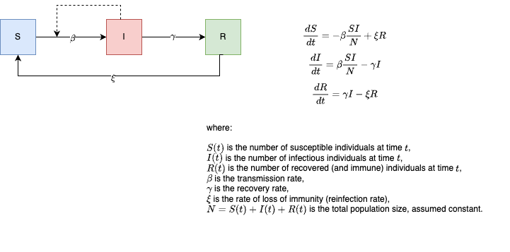

# How do agent based models and compartmental models differ in their predictions of SIRS transmission dynamics ?

Overall research topic: Investigating model assumptions using model comparisons. 

Members: Dumisane, Lindokuhle, Yanchao, Ryan, Wisdom and Stanley. 

Facilitator: Slimane BenMiled

The repository contains the code and work for group 6. The repository is structured into folders for code, data, outputs and resources.

1. The **data** folder contains folders holding data for different simulations titled `pX`, where X is the population size for the datasets contained within it, so that, p500 implies all datasets within the p500 folder are from ABM simulations where the population size is fixed at 500. Every folder within the data folder also has a README which contains details of the ABM simulations
2. The **code-files** folder contains R and netlogo code files. There are seperate files for ODE-SIRS and ChainBinomial-SIRS. The files are well structured to ensure that the code flow is intuitive, and systematic. In every code file (sirs-ode, sirs-chainbinomial), the resulting output is stored in the outputs folder
3. The **outputs** folder contains the outputs from running the SIRS models (ODE & ChainBinomial). The output has sepearet folders for the different models used. The csv files labelled using similar method of `pX`.

